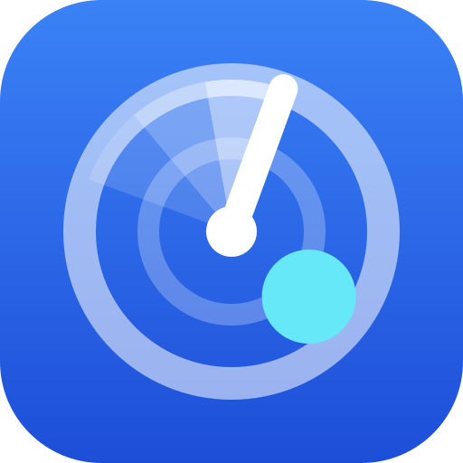

# Radar CNPJ — skill and MCP server for AI agents



Radar CNPJ lets an AI agent check Brazilian companies. One lookup returns the Receita Federal CNPJ record, the
partners, the sanctions, the federal tax debt, the government contracts and data from 40+ public databases, each
with its source date. This repository packages the Radar CNPJ skill and the connection to its remote MCP server
for Claude Code, Codex, Cursor and other agents.

**Site:** https://radar-cnpj.com · **MCP server:** `https://radar-cnpj.com/mcp?checkout=site` · **Prices:** https://radar-cnpj.com/pricing ·
**API docs:** https://radar-cnpj.com/developers

## What your agent can do

- Look up a company by CNPJ: status, activities (CNAE), address, partners, sanctions (CEIS, CNEP, CEPIM, TCU and
  CNIA), federal tax debt and contracts with the government.
- Search companies by name, trade name, partner, phone, address or activity, in a state or a city.
- Check a list of suppliers or customers in one call.
- Evaluate a business idea: count the active, opened and closed companies of an activity in a place.
- Monitor a CNPJ and read its changes.

Try: *"Check CNPJ 33.000.167/0001-01 for sanctions and federal tax debt."* or
*"How many bakeries are active in Águas Claras, DF?"*

## Install

Claude Code, as a plugin with the skill and the MCP server:

```
/plugin marketplace add wrpbr/radar-cnpj
/plugin install radar-cnpj@radar-cnpj
```

Any agent that reads Agent Skills (Claude Code, Codex, Cursor, OpenCode and others):

```bash
npx skills add wrpbr/radar-cnpj
```

Only the MCP server (remote, Streamable HTTP, no key for the free tools):

```bash
claude mcp add --transport http radar-cnpj 'https://radar-cnpj.com/mcp?checkout=site'   # Claude Code
codex mcp add radar-cnpj --url 'https://radar-cnpj.com/mcp?checkout=site'               # Codex
```

```json
{ "mcpServers": { "radar-cnpj": { "url": "https://radar-cnpj.com/mcp?checkout=site" } } }
```

The JSON above goes in `.cursor/mcp.json` for Cursor and in the MCP settings of most other clients. In Claude.ai and
Claude Desktop, open Settings → Connectors → Add custom connector and paste the server address.

## Price

The CNPJ record, the search, the idea evaluation and the export are free and need no key. The full check gives a
free allowance each day; after it, the check uses a pack or a plan. The bulk check, the company dossier and the
monitoring of more than 10 companies are paid. You buy plans and prepaid credit on the site, and plans do not renew
automatically. The plugin never pays: with `checkout=site`, the MCP server has no purchase tool and no payment
argument. The agent shows the price and the link, and after your purchase it uses your credit token. The current
prices are at https://radar-cnpj.com/pricing.

## What the plugin sends

The skill tells the agent to call the Radar CNPJ API at radar-cnpj.com. The MCP server also runs at radar-cnpj.com.
Your queries (CNPJ numbers, search terms and places) go to radar-cnpj.com over HTTPS. A credit token goes only when
you give one for a paid call. The plugin runs no local program and reads no local file.

## Data and limits

The data comes from the public CNPJ dump of Receita Federal and from the public databases that each answer names,
with their dates. Radar CNPJ is not an official certificate. Partner names, phones and e-mails are masked by
default. Use personal data only for a legitimate purpose, as the Brazilian data protection law (LGPD) requires.

## Em português

O Radar CNPJ deixa o agente de IA consultar empresas brasileiras. Ele traz a ficha da Receita, os sócios, as
sanções, a dívida ativa da União, os contratos com o governo e mais de 40 bases públicas, com a data de cada fonte.
Este repositório traz a skill e a conexão com o servidor MCP remoto. Instale com os comandos acima. A consulta de
CNPJ, a busca e a avaliação de ideia são grátis e não pedem chave. A compra é sempre no site, e o plugin nunca paga
sozinho. Os preços estão em https://radar-cnpj.com/pricing.

## Files

| File | What it is |
|---|---|
| `skills/radar-cnpj/SKILL.md` | The skill: which tool answers which question, and the rules for paid calls and personal data |
| `.mcp.json` | The remote MCP server of the plugin |
| `.claude-plugin/plugin.json` | The plugin manifest |
| `.claude-plugin/marketplace.json` | Lets Claude Code add this repository as a plugin marketplace |
| `server.json` | The manifest in the official MCP registry (`com.radar-cnpj/radar-cnpj`) |
| `glama.json` | The maintainer for the Glama MCP directory |

## License and contact

The files in this repository are under the MIT-0 license. The Radar CNPJ service and its data are not part of this
license: their use follows the [terms of use](https://radar-cnpj.com/termos) and the
[privacy policy](https://radar-cnpj.com/privacidade). For questions or problems, open an issue here or write to
contato@radar-cnpj.com.
